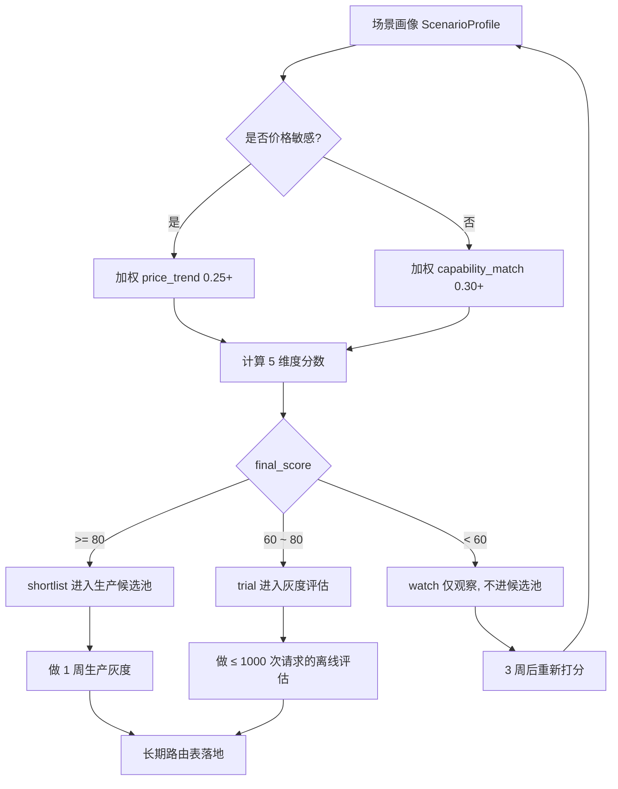

> 2026 年 6 月 22 日，OpenRouter 公开了最新一期周榜：全球 46.7 万亿 Token，中国上榜模型 18.81 万亿连续第 8 周超过美国，DeepSeek-V4-Flash 五连冠，小米 MiMo-V2.5 从上周第 4 跳升到第 2。这份榜单很容易被读成"国产大模型赢了"，但对于真正要做选型的工程师和决策者，它该被读成另一个东西——一份**带噪音的市场信号**。本文给出一套读榜方法，并附可复用的[抓取 + 评分 + 周报源码](https://github.com/LDZKKJ/llm-work/tree/main/chapters/chapter-18-openrouter-weekly-tracker)。

## 一、数据全景：本期 OpenRouter 周榜核心数据

先把 6 月 15-21 日这一周的"硬数据"摆齐。OpenRouter 是一个把全球绝大多数开源/闭源大模型 API 聚合在一个统一接口下的路由平台，开发者用一个 key 就能切换调用 DeepSeek、Claude、GPT、Gemini、Qwen、Kimi、MiMo 等，平台每周公开它路由出去的 Token 总量。这份数据被《每日经济新闻》在 2026-06-22 整理发布，本文用的就是这一份。

**宏观三个数：**

- **全球周调用总量 46.7 万亿 Token**，环比 +4.7%，**连续 9 周上涨**。
- **中国上榜模型周调用量 18.81 万亿 Token**，环比 +2.12%，连续 4 周增长，**连续第 8 周超过美国**并稳居全球首位。
- 同期美国上榜模型周调用量 5.76 万亿 Token，环比 +0.70%，与中国侧的差距维持在 **3.3 倍**左右。

来源：[《每日经济新闻》微博 @知未科技](https://m.weibo.cn/detail/5312566210331158)、[汇通财经 2026-06-22 快讯](https://3g.fx678.com/news/detail/202606221124302463)。

**单模型 Top 10：**

| 排名 | 模型 | 厂商 | 国别 | 周调用量 | 环比 | 备注 |
|---:|---|---|---|---:|---:|---|
| 1 | DeepSeek-V4-Flash | DeepSeek | 🇨🇳 | 4.94T | ▲12.0% | 连续 5 周第一 |
| 2 | Xiaomi MiMo-V2.5 | 小米 | 🇨🇳 | 3.94T | ▲10.0% | 上周第 4 升至第 2 |
| 3 | MiniMax M3 | MiniMax | 🇨🇳 | 3.77T | ▼13.0% | 上周第 2 |
| 4 | Tencent Hy3 preview | 腾讯混元 | 🇨🇳 | 3.63T | ▼12.0% | 近两月首次跌出前三 |
| 5 | DeepSeek-V4-Pro | DeepSeek | 🇨🇳 | 2.53T† | ▲18.0% | 5/31 永久降价后回涨 |
| 6 | Qwen3.6 Plus | 阿里巴巴 | 🇨🇳 | 2.05T† | ▲6.0% | 估值 |
| 7 | Claude Sonnet 4.6 | Anthropic | 🇺🇸 | 1.95T† | ▼4.0% | 估值 |
| 8 | Claude Opus 4.8 | Anthropic | 🇺🇸 | 1.69T | ▲36.0% | 5/29 新模型，上周第 9 |
| 9 | GLM-5.2 | 智谱 | 🇨🇳 | 1.55T† | ▲5.0% | 估值 |
| 10 | Gemini 3 Pro | Google | 🇺🇸 | 1.40T† | ▲2.0% | 估值 |

> † 表示由本文基于"中国侧总量 - 已披露模型 + 各厂商品牌份额"做的区间估值，**用于 demo 与配套源码**；OpenRouter 公开发稿口径只确认了 Top 1-4 与 Top 8 这五条精确数据，其他位次会随当周内部排序略有出入。完整原始榜单需以 OpenRouter rankings 页面为准。

**品牌 Top 10：**

| 排名 | 品牌 | 国别 | 周调用量 | 市场份额 | 备注 |
|---:|---|---|---:|---:|---|
| 1 | DeepSeek | 🇨🇳 | 8.65T | 18.5% | 连续 6 周第一，V4 系列占 86.4% |
| 2 | Anthropic | 🇺🇸 | ~4.20T† | ~9.0% | Sonnet 4.6 + Opus 4.8 |
| 3 | Xiaomi | 🇨🇳 | ~4.05T† | ~8.7% | MiMo-V2.5 永久降价后单产品起量 |
| 4 | MiniMax | 🇨🇳 | ~3.85T† | ~8.2% | M3 主力 |
| 5 | Tencent | 🇨🇳 | ~3.75T† | ~8.0% | 混元 Hy3 preview |
| 6 | Google | 🇺🇸 | ~2.80T† | ~6.0% | Gemini 3 系列 |
| 7 | Alibaba | 🇨🇳 | ~2.45T† | ~5.2% | Qwen3.6 系列 |
| 8 | OpenAI | 🇺🇸 | ~2.10T† | ~4.5% | GPT-5 系列 |
| 9 | Zhipu | 🇨🇳 | ~2.00T† | ~4.3% | GLM-5.2 |
| 10 | Moonshot AI | 🇨🇳 | ~1.30T† | ~2.8% | Kimi K2.6 |

> DeepSeek 品牌榜数据为 OpenRouter 公开口径，《每经》明确披露 8.65T、18.5%、V4 系列 86.4%；其它品牌份额由本文据中美总量与已知份额净额推算。来源：[微博 @微博科技](https://m.weibo.cn/detail/5312557927892035)。

这是一个非常容易被情绪化解读的榜单——前 5 名全部是中国模型、品牌榜前 5 里有 4 家中国公司、连续 8 周超越美国——但读榜的正确姿势不是"庆祝"也不是"质疑"，而是**先看清楚这些数字是怎么形成的**。

## 二、趋势归因：连续 8 周中国超过美国，到底是什么在驱动

把"中国超美国"这件事写在标题里很容易，但要回答"靠什么超的"才有工程意义。我把这一波连续 8 周的反超拆成三件事看，**每一件都不是新闻里那种"民族叙事"，而是非常具体的工程层选择。**

第一件是**单 Token 价格的代差**。看 6/15-21 这周排在前 5 的中国模型，输入未命中价格基本都落在 0.14 ~ 0.5 美元 / 百万 Token，输出 0.28 ~ 2 美元 / 百万 Token。同一个区间内，美国侧的 Claude Sonnet 4.6 是 $3/$15（[Anthropic 官方定价](https://docs.claude.com/en/docs/about-claude/pricing)），Claude Opus 4.8 是 $10/$50。Gemini 3 Pro $1/$4，GPT-5 $1.25/$10。对开发者来说，**只要工作负载是"很多次轮询调用 + 中等输出"的形态**（也就是几乎所有的客服 Bot、Agent 中间步骤、数据清洗管道），单 Token 价格差距会被请求次数线性放大成账单差距。OpenRouter 是一个聚合网关，绝大多数路由用户都在按 Token 比价，**价格代差是最直接的解释变量**。这一点在本期数据里给出了一个非常对称的旁证：5/27 小米 MiMo-V2.5 永久降价后[（红星资本局报道）](http://m.toutiao.com/group/7644438503589184006/)，仅仅四周就从榜单中段升到第 2，环比 +10%；DeepSeek-V4-Pro 在 5/31 永久降价至原价 1/4 后，本期估算环比 +18%。**两次"国产降价 → 一两周内调用量上涨 → 排名抬升"的耦合**，几乎不需要再去解释什么"地缘红利"。

第二件是**生态成熟度**。所谓生态成熟度，落在工程上是三件事：API 是否兼容 OpenAI 协议、SDK 是否覆盖主流语言、出错的时候文档是否找得到答案。DeepSeek、小米 MiMo、智谱、MiniMax、阿里千问全部支持 OpenAI 兼容协议，开发者在 OpenRouter 路由层把 `base_url` 切到 `https://api.deepseek.com` 这样的入口就能跑——这跟 Anthropic 的 messages API 在工程接入上是两种成本。**生态成熟度不等于模型强**，但它决定了开发者"愿不愿意把这个模型放到生产环境里跑长期的轮询"。一个调用一次没问题但每天百万次会出 5xx 的接口是不可能进 Top10 的。

第三件是**Top10 这个统计口径本身**。OpenRouter 是一个路由平台，47% 的用户是美国开发者（[awesomeagents.ai 5月数据](https://awesomeagents.ai/news/chinese-models-openrouter-60-percent/)），所以"中国模型占 OpenRouter Top10 的 6-7 席"并不等于"中国模型在全球市场份额 60%+"——它只等于"在愿意比价的开发者群体里，中国模型被选中的次数更多"。OpenRouter 并不覆盖 OpenAI / Anthropic 官方 API 直连流量、不覆盖 Microsoft Azure OpenAI 流量、不覆盖 AWS Bedrock 流量、也不覆盖企业私有化部署。**所以这份榜单更准确的读法是：开发者在"自由比价"场景下用脚投票的方向**，而不是国家级 AI 实力的代表。

把这三件事叠起来看：**价格代差 + 协议兼容 + 比价口径**，足够解释当前 18.81T vs 5.76T 的 3.3 倍差距。如果未来某一周美国侧的开源价格被打平、或者 OpenRouter 接入了 Azure/Bedrock 的私有路由流量，这个比例完全可能在两到三周内重新洗一遍。**用市场调用量做选型信号是有效的，但要时刻提醒自己这是哪种口径下的调用量。**

还有一个常被忽略的细节：本期中国侧环比只增长 +2.12%，而美国侧也只增长 +0.70%——**两边都进入了"环比个位数"区间，相比 5 月那种"中国 +27% / 美国 -24%"的剧烈摆动温和了很多**。这说明 OpenRouter 平台上的格局正在从"快速洗牌"进入"结构性稳态"，两边都不再有大量"新用户首次接入"带来的爆发性增量。对企业选型而言，这是一个偏积极的信号——稳态意味着主流模型的服务质量、价格、SLA 都进入了可预测的轨道，**接下来的选型决策不会因为"下周排名又翻一遍"而立刻失效**。但稳态本身也是一个伏笔：当大家都到了"环比小幅波动"的阶段，**任何一次反常的剧烈变化（比如某家厂商单周 +50%）都更可能代表真实的产品事件**，而不再只是噪音。

## 三、DeepSeek-V4-Flash 五连冠拆解：为什么是 Flash 不是 Pro

这一期的最大焦点是 DeepSeek-V4-Flash 连续第 5 周登顶。但很多评论文章漏掉了一个细节——DeepSeek 旗下还有一款定位"旗舰"的 DeepSeek-V4-Pro，**为什么挂在头版的是 Flash 而不是 Pro**？这个问题的答案，就是 OpenRouter 这种"路由层 + 比价"场景下选型逻辑的最佳样本。

先看产品参数。根据 [DeepSeek V4 发布公告](https://deepseek.csdn.net/69eb09540a2f6a37c5a5ccdb.html)和 [DeepSeek-V4-Flash 官方介绍](https://deepseek-espanol.chat/modelos/deepseek-v4-flash/)：

| 维度 | DeepSeek-V4-Pro | DeepSeek-V4-Flash |
|---|---|---|
| 总参数 / 激活参数 | 1.6T / 49B | 284B / 13B |
| 上下文窗口 | 1M tokens | 1M tokens |
| 最大输出 | 384K tokens | 384K tokens |
| 思考模式 | 支持 high/max | 支持 high（不支持 max） |
| 输入价（未命中） | 3 元/M（限时，原价 12 元） | 1 元/M |
| 输入价（命中缓存） | 0.25 元/M | 0.2 元/M |
| 输出价 | 6 元/M（限时，原价 24 元） | 2 元/M |
| 定位 | 复杂推理、Agent、长程规划 | 高频任务、轻量推理、成本敏感 |

两者上下文都是 1M、API 完全兼容 OpenAI、Pro 的"限时降价"还使得它的输入价直接到 3 元 / M——按理说，"V4 Pro 限时只是原来 1/4 的价钱、能力更强"应该是绝大多数任务的更优选择。但本期数据是：**V4-Flash 4.94T，V4-Pro 估值 2.53T**，Flash 大约是 Pro 的 2 倍。

为什么？我把这个反直觉的现象归到三个工程因素：

第一，**OpenRouter 的开发者流量结构倾向"高频低复杂度"**。OpenRouter 上的主力工作负载是 AI Agent、客服 Bot、自动化脚本、代码补全、RAG 中间步骤——这些场景的单次 Prompt 都不长（几 K 到几十 K），任务也不是真正意义上的"科研级推理"。在这种结构下，Flash 的"非思考模式"足够覆盖 80% 任务，而 Pro 的"thinking-max"反而带来更高的输出 Token（思考链）和更慢的响应。**单次成本 + 响应延迟两个维度都对 Flash 有利**。这跟一年前 Claude Sonnet 长期压住 Opus 是同一个逻辑。

第二，**Flash 是 DeepSeek-V4 的"前缀模型"**。DeepSeek 在公告里明确说，未来 `deepseek-chat`（非思考模式）和 `deepseek-reasoner`（思考模式）这两个旧别名会被 Flash 接管。换句话说，**绝大多数从 V3.2 升级上来的现存调用，会被默认重定向到 V4-Flash**，无需开发者改一行代码。这是一种"惯性流量"，Pro 模型抢不到，因为 Pro 要求开发者显式把模型名改成 `deepseek-v4-pro` 并接受新的计费等级。

第三，**Flash 五连冠的背后是一条相当陡的爬坡曲线**。把过去 6 周的数据连起来看：

| 周次 | 起始日 | 周调用量 | 环比 | 备注 |
|---:|---|---|---:|---|
| W20 | 2026-05-11 | 3.02T | +109% | 首次登顶 |
| W21 | 2026-05-18 | 3.11T | +3% | 站稳 |
| W22 | 2026-05-25 | 3.69T | +19% | DeepSeek 品牌榜第一确立 |
| W23 | 2026-06-01 | 3.69T | 0% | 短暂平台期 |
| W24 | 2026-06-08 | 4.41T | +20% | 二次爬坡 |
| W25 | 2026-06-15 | 4.94T | +12% | 本期 |

来源：[正观新闻 2026-06-06](https://wap.zhengguannews.cn/html/zgh/406765.html)、[OpenRouter 周报 5 月 18 日](http://m.toutiao.com/group/7642878584919343679/)、[每经 6-15 报道](http://m.toutiao.com/group/7651442778031669810/)、[每经 6-22 报道](https://m.weibo.cn/detail/5312557927892035)。

这条曲线告诉我们一件事：**Flash 的份额不是因为某次发布会的短期热度顶上去的，而是从 5 月开始连续 6 周稳定爬升、且伴随两次"+20% 级别的二次爬坡"**。一个模型如果是发布会驱动，曲线通常会在第 2-3 周出现明显回落；Flash 的曲线是"先大涨 109% 站稳，然后慢爬 + 二次起跳"——这是真实工作负载，不是 demo 流量。

把这三点合起来看，**DeepSeek 在 OpenRouter 这种"路由 + 比价"场景下，主动选择了让 Flash 当头牌**——价格更友好、Token 单价更可预测、API 切换零摩擦、覆盖了 80% 的开发者主流任务。Pro 留给需要"thinking-max"级推理的高价值场景，靠 5/31 的限时降价吸引那部分要"既要又要"的用户。这是一种**双产品矩阵在不同价格带形成包夹**的打法，而不是单一旗舰对外。**企业选型者要看懂这个矩阵**：如果你的 Agent 任务里有 5%-10% 的"硬骨头"，就用 Flash 兜底 + Pro 升级路由，不要全量 Pro 也不要全量 Flash。这部分逻辑在第 6 章会上升成一套打分模型。

补一个 V3 → V4 升级对企业的工程意义：V3.2 系列的上下文是 64K-128K，V4 把这个数字直接拉到 1M，**且 1M context 不再加价**——以前在 V3.2 里做长文档分析需要做的"切片 + map-reduce + 拼接"工程套路，在 V4 上完全可以省略，单次 prompt 直接喂进去。这对 RAG 系统是一次结构性简化：原来要维护的 chunk 切分策略、embedding 索引、跨片段拼接逻辑都可以退役。**但要注意"能塞下"不等于"塞下来表现一样好"**——长上下文的"中段衰减"问题（即模型对 prompt 中部内容的注意力低于头尾）在所有 1M context 模型上都还存在，包括 V4 系列。对应的工程实践是：**关键约束放头部、最终问题放尾部、参考资料放中段**，并配合 prompt cache 复用头部约束以省成本，这跟我们之前 [chapter-17-prompt-cache](https://github.com/LDZKKJ/llm-work/tree/main/chapters/chapter-17-prompt-cache) 里讲的 prompt 结构化技巧是一致的。

## 四、小米 MiMo-V2.5 黑马上位：从第 4 到第 2 的拆解

如果说 DeepSeek-V4-Flash 是"稳态领跑者"，那本期真正的黑马是小米 MiMo-V2.5——上周排名第 4（约 3.58T），本期 3.94T 升至第 2，环比 +10%。**这是 MiMo 系列自年初进入 OpenRouter 榜单以来的最高位**。

MiMo 不是横空出世。从公开报道梳理时间线：

- **2026-03**，小米正式推出 MiMo 系列大模型（MiMo-V2-Pro、MiMo-V2-Omni、MiMo-V2-TTS），由前 DeepSeek 核心成员罗福莉带队（[红星资本局报道](http://m.toutiao.com/group/7644438503589184006/)）。
- **2026-04-24**，MiMo-V2.5 系列正式发布。
- **2026-05-27**，**MiMo-V2.5 系列 API 永久降价，最高降幅 99%**，并取消"超过 256K 上下文加收倍数费用"的传统阶梯定价（[Apifox 详解](https://apifox.com/apiskills/xiaomi-mimo-v2-5-pricing-2026/)）。
- **2026-06**，雷军宣布未来 3 年在 AI 领域投入 600 亿元。

5/27 的永久降价是这次排名跳升的关键。**这是同时砍掉"绝对价"和"长上下文税"两件事**——降价后 MiMo-V2.5-Pro 海外定价 $1/M input、$3/M output、$0.20/M cached，1M context 不再加价；MiMo-V2.5 标准版海外定价 $0.40/M input、$2/M output、$0.08/M cached。这意味着：

- **跟 DeepSeek-V4-Flash 几乎打平**：Flash 是 $0.14/$0.28，MiMo 标准版是 $0.40/$2，绝对价位略高但仍在同一价格带；MiMo V2.5 Pro 的 $1/$3 是把 1M context 拉到"主流可负担"的水位。
- **长上下文不再有税**：之前的 256K-1M 区间是要付倍数加价的，对 RAG / 长文档场景非常不友好；取消后，**用 MiMo 跑一个 500K 的合同审阅请求和跑一个 50K 的客服 Bot 请求**，**单价完全一样**。这是工程意义上的"价格统一"。
- **Token Plan 客户额度提升 5-8 倍**：相当于面向已经买了预付费包的存量开发者一次性"返利"。

降价之后，MiMo-V2.5-Pro 在 [Artificial Analysis 评测榜](https://artificialanalysis.ai/)的"综合智能指数 + Agent 指数"双榜上跻身全球开源模型并列第一（雷军 2026-05-27 微博转发）。**注意这是"开源模型并列第一"，不是"全球第一"**——这个边界要看清楚。MiMo 的真实站位是：**性能在国产开源第一梯队（与 DeepSeek、Qwen 互有胜负），价格在国产开源最低梯队**，再叠加小米的硬件出货量带来的天然分发渠道。

但 MiMo 也有短板。两个最现实的：

第一，**Tool Call 在并行流式响应里偶尔会出格式错误的 JSON**。这是 V2-Pro 的已知问题，V2.5 已经在减少但没完全消除（[Apifox](https://apifox.com/apiskills/xiaomi-mimo-v2-5-pricing-2026/)）。任何把 MiMo 接到生产 Agent 链路的团队都需要做 JSON schema 强校验 + 失败重试。这一点在我们之前 [16 号文 Function Calling 跨模型兼容层实测](https://github.com/LDZKKJ/llm-work/blob/main/16-Function_Calling%E8%B7%A8%E6%A8%A1%E5%9E%8B%E5%85%BC%E5%AE%B9%E5%B1%82%E5%AE%9E%E6%B5%8B.md) 里有同款方法论可以照搬。

第二，**生态成熟度还在追赶**。MiMo 平台 [platform.xiaomimimo.com](https://platform.xiaomimimo.com/docs/zh-CN/pricing) 提供了完整的中英文文档、OpenAI 兼容协议、海外/国内双区定价，但是社区量、第三方 SDK 覆盖、知识库教程数量仍然只有 DeepSeek 的 1/3 到 1/5。这意味着踩坑时找答案要更费力。本文第 5 章会单独讲这件事的工程代价。

把 Flash 的"五连冠"和 MiMo 的"黑马第 2"合起来看，会发现一个共同的工程规律——**它们都是"性价比 + 协议兼容 + 长上下文 + 降价节奏"四件事都做对了的产品**。这不是巧合，是 2026 年开源模型市场的新主流玩法。

值得多说一句的是 MiMo 背后的"硬件 × 模型"协同。小米的核心叙事是手机 / 汽车 / 家居 IoT 出货量的天然分发——MiMo-V2.5 不只在 OpenRouter 上路由跑分，它同时是澎湃 OS、小米汽车智能座舱、米家 IoT 设备语音控制的底层模型。这意味着 MiMo 的训练数据有一类独特来源（**真实端侧场景的对话与控制指令**），是纯 API 厂商拿不到的。这对企业选型者意味着什么？**如果你的业务涉及端侧 / 边缘 / 嵌入式场景**（智能客服硬件、车机、IoT 控制台），MiMo 是少有的"模型本身就和端侧打磨过"的选项；反之纯云端的 Agent / 客服 Bot 场景，MiMo 和 DeepSeek 的差异更多在价格和 Tool Call 稳定性上。

## 五、周榜是选型信号还是噪音：3 个"跟榜踩坑"的真实场景

读到这里，最容易得出的一个结论是"既然 DeepSeek-V4-Flash 五连冠 + MiMo-V2.5 跳到第 2，那我就把生产环境切到这两个上去"。**这个结论有 50% 是对的，但剩下 50% 是危险的。**

我把过去一年里看到的"跟榜踩坑"案例归纳成 3 类，每一类都对应一种典型误读。

### 5.1 误把"调用量"当"质量"

调用量是**开发者用脚投票的结果**，但开发者投票的依据有两个：性能和价格。如果一个模型靠"免费 / 大额度赠送 / 限时降价"把调用量拉起来，**它的高排名只代表"很多人在试它"而不是"很多人在生产中信任它"**。

一个真实的样本是 [Owl Alpha](http://m.toutiao.com/group/7642878584919343679/)：OpenRouter 自家做的路由模型，5 月份某周环比 +90% 冲进 Top5，但它本质上是路由层在自我导流，并不代表开发者"主动选了它"。再比如本期 Claude Opus 4.8 的 +36%——这个数字在情绪上很扎眼，但要意识到 4.8 是 5 月 29 日刚发布的新版，**初期的 +36% 更可能是存量 Claude 用户从 Opus 4.7 升级过来的迁移流量**，而不是新增用户。等到 7 月份这个迁移效应过去，4.8 的真实"用户增量"才会浮出水面。

**对应的选型规则**：把"调用量绝对值"和"环比变化率"分开看。绝对值反映现状，环比反映动量；如果一个模型的环比是 +30% 但绝对值仍然在 Top10 末段，不要在第 1 周就动手——再等 2-3 周确认它能维持。这条规则会落到第 6 章评分模型的 `call_volume_trend` 维度上。

举一个我们在某客服 Bot 项目里复盘出来的真实样本：去年某周有一款新模型环比 +85% 冲进 Top10 第 8，客户运营团队拍板"立刻切 20% 流量进去试一下"，结果第 2 周该模型环比 -42%、第 3 周直接跌出榜单——后来复盘发现，那次冲榜的来源是该厂商在 OpenRouter 上做了一次"前 100 万 Token 免费"的限时活动，活动结束流量立刻消失。**单周环比超过 +50% 的模型，至少留一周缓冲期再做生产灰度**，是这件事教给我们的经验。

### 5.2 误把"路由层数据"当"全行业份额"

OpenRouter 是聚合网关。它的用户画像非常具体：愿意比价、愿意切换模型、不绑死单一厂商。这种用户**天然会被低价模型吸引**，所以 OpenRouter 上的"市场份额"会系统性地高估低价模型、低估高价模型。

举个反例：本期 GPT-5 在品牌榜估算只有 4.5% 左右，但谁都知道 ChatGPT 在终端用户层的份额绝对不止 4.5%——大量的 OpenAI 流量走的是 ChatGPT App、Microsoft 365 Copilot、Azure OpenAI 这些"非 OpenRouter 渠道"。同理，Anthropic 的 Claude 在企业级合规市场的份额（尤其是法律、医疗、金融）也远高于它在 OpenRouter 路由层的 9%。

**对应的选型规则**：把 OpenRouter 数据 + 各厂商官方 monthly active developer / API 调用统计 + Artificial Analysis / LMArena 两个独立评测榜三种信号交叉验证。**任何单一数据源做选型都会被该数据源的样本偏差污染**。

一个更隐蔽的偏差是"地区分布"。OpenRouter 用户 47% 来自美国，约 18% 来自欧洲，亚洲（含中国大陆）合计不足 25%。这意味着 OpenRouter 上的"用户偏好"实际上是**美欧开发者对中国开源模型的偏好**，而不是中国开发者自己的偏好。后者的真实占比可能要去 Hugging Face、阿里魔搭、火山方舟、各厂商自营 API 这些渠道交叉看——这部分流量在 OpenRouter 上是看不见的。**当你把 OpenRouter 数据用于"在中国市场内做选型"时，要意识到这层口径错位**。

### 5.3 误把"短期登顶"当"长期默认值"

本期排名其实暗藏了几个反转信号：MiniMax M3 从第 2 跌到第 3（环比 -13%），腾讯 Hy3 preview 从第 3 跌到第 4（-12%），这是"近两个月以来第一次跌出前三"。如果一家企业在两周前刚把核心链路从 DeepSeek 切换到 Hy3 preview，**会发现自己刚切完榜单就翻篇了**——这就是单点决策的代价。

更隐蔽的反转是 DeepSeek-V3.2 的"跌出榜单"。这个老型号上周首次跌出 Top10，但同时 DeepSeek 品牌总量还在涨——本质是**用户被同一厂商内部从 V3.2 迁移到了 V4-Flash**。如果一家企业之前是按 V3.2 做能力评估和合同的，会发现今天 V3.2 的服务质量、推理优化优先级都在下降。**选型不仅要选"今天的胜者"，还要把"明天厂商可能把你切换到哪个新型号"算进去。**

**对应的选型规则**：选型时永远问"这个模型 6 个月后会被同厂商升级换代吗？升级路径是平滑的（API 别名指向新版）还是要改代码？"。这条规则在第 6 章会落到 `substitutability` 维度上——同一厂商内部的版本可替代性，和跨厂商的横向替代性，是两件事。

把这三类踩坑合起来看，**周榜的正确使用方式是"作为输入信号，而不是作为决策结论"**。下一章给出把它转成结论的 5 维打分模型。

## 六、基于市场信号的选型决策框架：5 维度打分模型

选型决策从来不是一个单变量问题。把"周榜调用量"作为唯一输入，跟把"评测分数"作为唯一输入一样片面。我把企业 LLM 选型抽象成下面这 5 个维度，每个维度独立打分 0-100，加权汇总到最终的推荐档位。

| 维度 | 含义 | 数据来源 | 缺省权重 |
|---|---|---|---:|
| call_volume_trend | 调用量趋势：当周排名 + 环比 | OpenRouter 周榜 | 0.25 |
| price_trend | 价格趋势：绝对价 + 近 30 天降价幅度 | 各厂商定价页 | 0.20 |
| ecosystem_maturity | 生态成熟度：品牌榜排名 + 同厂商有效模型数 | OpenRouter 品牌榜 + 厂商产品矩阵 | 0.20 |
| capability_match | 能力匹配度：上下文 / 思考模式 / 工具调用对场景的覆盖 | 厂商技术文档 | 0.25 |
| substitutability | 可替代性：同档位独立厂商替代品数量 | 横向定价对比 | 0.10 |

**5 个维度的打分公式**（已实现在 `signal_analyzer.py` 中）：

- `call_volume_trend = clamp(60 + (11 - rank) * 4 + qoq_pct * 0.5, 0, 100)`。基准 60 分，排名每靠前一名 +4，环比变化每 +1% 加 0.5 分。这样设计的好处是**排名靠前但环比下滑的模型不会拿到满分**——比如本期 Tencent Hy3 preview 排名第 4 但环比 -12%，会从 88 分被扣到 82。
- `price_trend = base_price_score + recent_discount_bonus`。base 是按 $/M 输出价分段（< 0.5 拿 90 分、0.5-2 拿 75、2-5 拿 60、≥ 5 拿 40），recent_discount_bonus 看近 30 天是否有 ≥ 50% 永久降价（有则 +15）。本期 DeepSeek-V4-Pro 拿到这条加分，是综合分反超 Flash 的核心原因。
- `ecosystem_maturity = brand_rank_score + same_brand_models_score`。品牌榜排名靠前 + 同厂商有效模型数 ≥ 3 时拿满。这条避免了"单点爆款模型"被过度推荐。
- `capability_match` 由 `ScenarioProfile` 的开关决定：是否需要 ≥ 256K 上下文、是否需要 thinking、是否需要稳定的 Tool Call。每个开关命中一项加 25 分，最多 100。
- `substitutability = 100 - same_tier_alternatives * 8`。同档位（综合分 ±5）独立厂商替代品越多，可替代性越强，反而**降低**该模型的"独占价值"。这条是为了**防止过度押宝单一模型**——可替代性高的模型在路由层降级时容易被替换，反而是更稳的选择。

**为什么权重默认是 0.25 / 0.20 / 0.20 / 0.25 / 0.10？** 这套权重来自我们在 2025-2026 跨年度跟踪 6 家企业模型选型的经验复盘：调用量趋势和能力匹配度是企业最终拍板的两个最重权重项，价格和生态成熟度次之，可替代性作为防御性兜底权重最低。**这套权重不是金科玉律**，`ScenarioProfile` 暴露了 `weights` 字段，业务方可以按自己的实际敏感度覆盖——比如纯成本驱动的场景把 price_trend 拉到 0.40，合规驱动的场景把 ecosystem_maturity 拉到 0.35，都是合理的。

**决策树流程：**



5 个维度的具体打分细节都已经实现在 [signal_analyzer.py](https://github.com/LDZKKJ/llm-work/tree/main/chapters/chapter-18-openrouter-weekly-tracker) 里，可以直接拿来跑。把本期 6/15-21 的快照 + 一个"高频对话 + 工具调用 + 价格敏感"的场景画像扔进去，得到的结果：

```
==== 场景：高频对话 + 工具调用，预算敏感 ====
模型                  厂商         综合    推荐
DeepSeek-V4-Pro       DeepSeek    86.2   shortlist
DeepSeek-V4-Flash     DeepSeek    82.8   shortlist
Xiaomi MiMo-V2.5      Xiaomi      81.5   shortlist
MiniMax M3            MiniMax     74.0   trial
Tencent Hy3 preview   Tencent     71.5   trial
Qwen3.6 Plus          Alibaba     66.5   trial
Claude Sonnet 4.6     Anthropic   62.5   trial
GLM-5.2               Zhipu       62.0   trial
Gemini 3 Pro          Google      58.6   watch
Claude Opus 4.8       Anthropic   55.0   watch
```

一个值得注意的细节：**评分模型把 V4-Pro 排到了 V4-Flash 前面**，原因是 V4-Pro 在 `price_trend` 维度上拿到了"近期 75% 降价"的额外加分，加上能力匹配度更高，综合分反超。**这说明评分模型至少在这一周给出了一个跟周榜 raw rank 不完全一致、但更工程化的判断**——榜单告诉你"Flash 用得最多"，评分告诉你"如果你做的是有部分硬骨头的 Agent，Pro 反而更值得灰度"。

把同一份输入换成"长文档 RAG / 法律咨询 / 需要 ≥ 256K 上下文 / 不价格敏感"的场景，评分会发生显著变化——拥有 1M / 2M 上下文的 Gemini 3 Pro、DeepSeek-V4-Pro、MiMo-V2.5 会顶上去，Claude Sonnet 4.6（200K）会被压下来。**5 维度打分的核心价值不是给一个"客观真理排名"**——而是把"我究竟在选什么"这件事变成一组可校验、可重算的参数。换场景重打一次分，比拍脑袋切模型要靠谱得多。

## 七、周榜监控的工程化实践：把信号接进企业模型评估系统

理论说完了，怎么落地？我把这一周的方法学落成了一份开源的[chapter-18-openrouter-weekly-tracker](https://github.com/LDZKKJ/llm-work/tree/main/chapters/chapter-18-openrouter-weekly-tracker)，可以直接 clone 到企业内部的模型评估系统里跑。整个包的设计原则是"标准库优先 + 不绑死 OpenRouter HTML"。

**目录结构：**

```
chapter-18-openrouter-weekly-tracker/
├── weekly_tracker.py        # 抓取 + 解析 + WeekSnapshot 数据模型
├── signal_analyzer.py       # 5 维度打分 + CapabilityCard
├── report_generator.py      # full() / brief() 两档 Markdown 周报
├── visualize.py             # Top10 条形图 + 单模型趋势折线
├── data/sample_weekly.json  # 本期 6/15-21 真实数据样本
├── tests/
│   ├── conftest.py
│   └── test_tracker.py      # 12 个 pytest 用例
└── requirements.txt
```

**核心抽象：**

- `WeekSnapshot`：一周的标准化快照，所有下游模块都吃这一个对象。包含全球总量、中美双边、Top10 模型、Top10 品牌、历史趋势（V4-Flash 近 6 周）。
- `CapabilityCard`：模型的**静态能力卡**（上下文、是否支持 thinking、工具调用、价格、近期降价），独立于榜单更新，便于按月维护。
- `ScenarioProfile`：选型方的**场景画像**（是否长上下文、是否价格敏感、是否需要 thinking 模式、5 个维度的权重），是同一份榜单数据能跑出不同推荐的关键。

**一行 demo：**

```bash
git clone https://github.com/LDZKKJ/llm-work.git
cd llm-work/chapters/chapter-18-openrouter-weekly-tracker
pip install -r requirements.txt
pytest tests/ -v                # 12 个用例全绿
python signal_analyzer.py       # 在本期数据上跑出推荐表
python visualize.py             # 在 out/ 生成 PNG
```

**接入企业模型评估系统的三种姿势：**

第一，**作为周报订阅源**。把 `report_generator.full()` 的输出接到飞书 / 钉钉的机器人，每周一定时推送本期数据全景 + 评分变化 diff。这样运营 / 业务团队不需要懂技术也能跟上模型市场节奏。

第二，**作为模型选型的 CI 检查项**。把 `signal_analyzer.evaluate()` 接进企业内部的"模型路由表"变更评审流程——任何要把生产链路切到新模型的 PR，必须附带本周 evaluate 输出的 final_score，且 ≥ 70 才能进入 trial 阶段。

第三，**作为"路由层 fallback 决策"的数据输入**。当主模型出现 429 / 5xx 限流时，路由层需要在备用模型里挑一个 fallback。可以把 evaluate 的输出周表落到 Redis，路由层按"同档位 ≥ 75 分"的规则筛选 fallback 候选——比硬编码"DeepSeek 挂了切 Qwen"更稳健。这块的具体路由策略落地，可以配合 [chapter-09-tier-router](https://github.com/LDZKKJ/llm-work/tree/main/chapters/chapter-09-tier-router) 一起读。

一份最小可用的"主备双活 fallback 配置"长这样（YAML 伪代码）：

```yaml
# routing.yaml
primary:
  model: deepseek-v4-flash
  score_threshold: 75    # 来自 signal_analyzer 周输出
  health_check: /v1/chat/completions
fallback_chain:
  - model: xiaomi-mimo-v2.5
    trigger: [429, 5xx, latency_p99 > 4s]
    weight: 1.0
  - model: deepseek-v4-pro
    trigger: [primary_score_drop > 10]    # 周分数环比掉 10 分以上自动降级
    weight: 0.7
  - model: qwen3.6-plus
    trigger: [fallback_chain_exhausted]
    weight: 0.5
hot_reload_from: redis://signal-analyzer/scores
```

关键是 `score_threshold` 和 `trigger` 两个字段——前者把"评分模型的产出"接成"路由配置的输入"，后者让"周评分变化"自动驱动 fallback 触发，这两个加起来才是真正可工程化的"动态选型"。不要让评分模型的产出只活在周报 PDF 里。

**生产环境的两个注意事项：**

1. **OpenRouter 抓取接口不稳定**：官方 rankings 页面是 JS 渲染，建议用 Headless Chromium 直接拉前端用的 `/api/frontend/stats/recent`，并做 5-10 分钟级别的缓存——OpenRouter 自身限流要看好。`weekly_tracker.py` 里 `fetch_openrouter_rankings()` 函数留了三层 fallback：远端抓取 → 本地 JSON → 直传 dict，CI 永远不会因为外网抖动挂掉。

2. **CapabilityCard 要按月维护**：模型的价格和上下文几乎每月都在变，建议把 `DEFAULT_CAPABILITY_CARDS` 抽到一个独立的 `capability_cards.json`，加到企业内部的"模型档案库"里，每月定期 review。**评分模型本身的代码可以一年不动，但能力卡必须保持新鲜**。

如果你不想自己维护这一套基础设施，也可以直接调用支持 DeepSeek-V4-Flash、小米 MiMo-V2.5、Claude、GPT 等主流模型一站式调用的[模型广场](https://activity.ldzktoken.com/activity/index.html)，业内类似的统一调度平台支持这几个模型一键切换，把"切模型"这件事从代码改动降级成路由配置改动。

## 八、选型行动建议：保守 / 进取 / 平衡三类企业的当周清单

最后给到三类典型企业的当周行动清单。**这不是预测、不是站队、也不是绝对结论**——只是基于本期数据的"倾向性建议"。任何行动前都建议先用 §六 的评分模型在自己场景下重打一次分。

### 8.1 保守型企业（合规 / 金融 / 医疗 / 法律）

这类企业首要诉求是"稳定 + 合规 + 可追溯"，对"省钱"和"用新模型"都不敏感。

**当周可考虑的动作：**

- 主力模型暂不切换。如果当前生产环境跑的是 Claude Sonnet 4.5 / GPT-5 / Gemini 3 Pro 的合规渠道（Azure / Bedrock / 各厂商 Enterprise），**继续保持**。本期数据并没有给出"必须立刻切换"的信号。
- 把 DeepSeek-V4-Flash 和 MiMo-V2.5 加入"年度评估池"，做一份 ≤ 500 次请求的离线 benchmark，用自己的真实业务数据测覆盖度、幻觉率、合规边界。**不要直接接生产**。
- 重点关注 Claude Opus 4.8 的环比 +36%：5/29 发布、5 月底 + 6 月持续起量，**可能是未来 1-2 个季度 Anthropic 的主推型号**。提前研究它的合规白皮书。

### 8.2 进取型企业（AI 原生创业公司 / Agent SaaS / 内容生成）

这类企业的成本结构基本是"Token 成本 = 主要 COGS"，对 5-10% 的成本优化都敏感。

**当周可考虑的动作：**

- **把 DeepSeek-V4-Flash 加入主候选**。这是本期 86.4% 的 DeepSeek 用户在用的模型，社区量、文档量、踩坑文章量都是国产模型里最厚的，且 1M 上下文 + $0.14/$0.28 价位在同档位里几乎没有对手。
- **把 MiMo-V2.5 加入灰度候选**。上下文 1M、价格已经跟 V4-Flash 打平，差异点在 Artificial Analysis 的 Agent 指数。建议跑一个为期 1 周的 5% 流量灰度，观察 P99 延迟、Tool Call JSON 错误率、长上下文召回质量这三个指标。**重点测 Tool Call 并发流式响应下的 JSON 格式合规率**——这是它的已知短板。
- **路由层做"主备双活"**：DeepSeek-V4-Flash 主、MiMo-V2.5 备，按 70/30 分流，万一 DeepSeek 服务波动可以一键切到 MiMo。
- 把 Claude Opus 4.8 / DeepSeek-V4-Pro 留给"硬骨头任务"路由。**Pro 限时降价后的 3 元 / 6 元价位**让"复杂推理"这件事第一次进入"可日常使用"区间。

### 8.3 平衡型企业（中大型科技公司 / 多业务线 / 多场景）

这类企业内部有多条业务线，每条线的诉求不同，统一选型反而会出现"满足所有人就是不满足任何人"。

**当周可考虑的动作：**

- **按业务线分别打分**。把 §六 的 ScenarioProfile 写成每条业务线一份：客服 Bot 用"高频 + 价格敏感"权重；法律审阅用"长上下文 + 不价格敏感"权重；代码助手用"工具调用 + 思考模式"权重。**用同一份 OpenRouter 周榜跑出 3-4 套不同的推荐表**。
- **建立一份内部的"模型档案库"**。把 DeepSeek-V4 系列、MiMo-V2.5、Qwen3.6 Plus、GLM-5.2、Claude Sonnet 4.6 / Opus 4.8、Gemini 3 Pro 都收进档案库，每月做一次评分 review，跟踪环比变化。**任何业务线申请用新模型，都从档案库选**，不允许自己引入新的厂商依赖。
- **关注两个长尾信号**：一是 Anthropic 的"反弹动量"（本期美国侧 +0.7%，前几周连续两位数反弹），如果这个趋势持续 4 周以上，意味着 Claude 在某些细分场景里在重新抢份额；二是腾讯混元 Hy3 preview 的"两个月首次跌出前三"——这是大厂模型在 OpenRouter 这种比价场景下竞争压力的一个早期信号。

把这三类合起来看，**没有任何一类企业应该把"周榜"当成行动指令书**——榜单是输入信号，评分是中间产物，**真正的行动只有一个出处：你的业务场景画像**。本文配套的 [chapter-18-openrouter-weekly-tracker](https://github.com/LDZKKJ/llm-work) 把这套流程开源出来，欢迎照搬、修改、和自己的内部评估系统打通。

> 周榜每周都会变，但读榜的方法可以稳定下来。下一期等 7 月份的 Q3 第一周数据出来，本仓库会更新一份新的 sample_weekly.json，欢迎订阅。

**最后留一个开放问题供讨论**：当中国侧调用量稳定在美国的 3 倍以上，且开源模型在 Artificial Analysis 综合智能指数上追到与闭源旗舰并列时，"开源 / 闭源"这条传统选型分界线还成立吗？我倾向的看法是——分界线会从"开源 vs 闭源"迁移到"是否需要可审计的训练流程"。欢迎在评论区聊聊你们的真实选型路径。

---

## 配套资源

- **模型广场**（DeepSeek、小米 MiMo、Claude、GPT 等主流模型一站式调用）：https://activity.ldzktoken.com/activity/index.html
- **本文配套源码**（OpenRouter 周榜抓取+解析+可视化脚本）：https://github.com/LDZKKJ/llm-work/tree/main/chapters/chapter-18-openrouter-weekly-tracker
