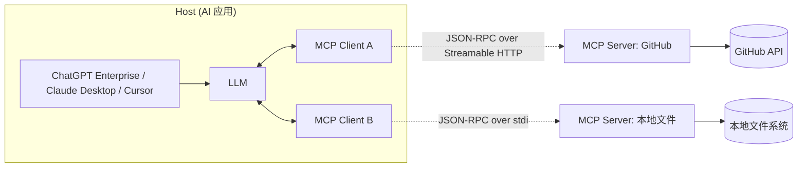
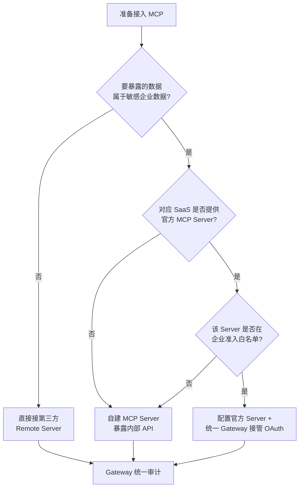
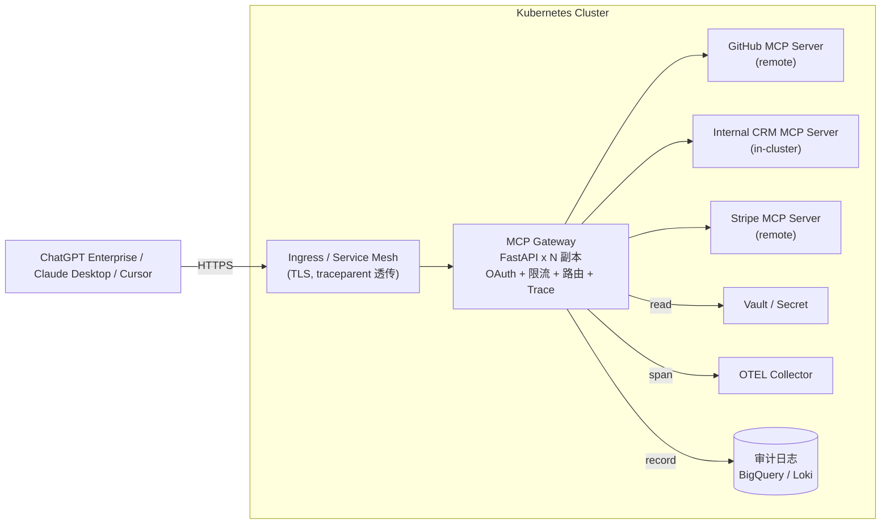
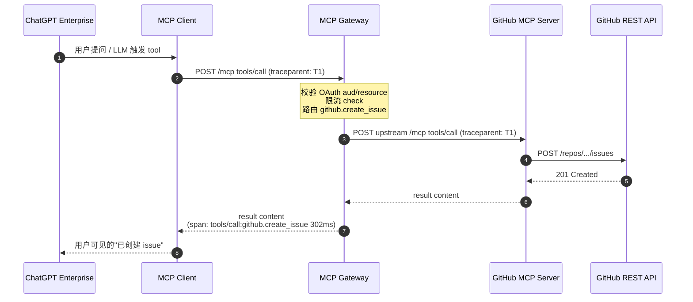
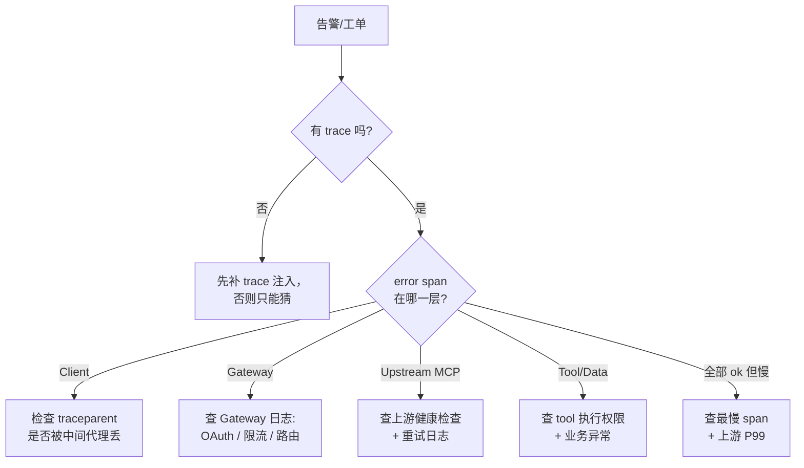

# MCP 企业接入 2026 实战：从 OpenAI 6/14 新公告到生产部署的 6 大踩坑指南

> 2026 年 6 月 14 日，OpenAI 把 ChatGPT Enterprise / Edu 的完整 MCP 支持 + Developer Mode 正式开了门——管理员、企业开发者可以直接在 ChatGPT 里上传、审核、发布带"写入/修改"权限的自定义 MCP 应用（[OpenAI 帮助中心](https://help.openai.com/zh-hans-cn/articles/12584461-developer-mode-and-full-mcp-connectors-in-chatgpt-beta)）。这是 Model Context Protocol 自 2024-11 开源以来在**企业产品形态**上最显眼的一次落地。一周前，微软在 Azure AI Foundry Agents 上也把"远程 MCP Server 作为 tool 接入"做成了 GA 能力（[Microsoft Learn](https://learn.microsoft.com/en-ca/AZURE/foundry/agents/how-to/tools/model-context-protocol)）。这两件事叠在一起，意味着 2026 下半年企业 AI 采购的语境彻底变了——**MCP 已经不是"要不要接"的问题，而是"怎么安全、合规、可扩展地接"的问题**。本文给读者三件东西：一份本期接入语境的现状评估、6 个真实踩坑的工程化复盘、一套可直接 fork 的 [Gateway 参考实现](https://github.com/LDZKKJ/llm-work/tree/main/chapters/chapter-19-mcp-enterprise-toolkit)。

## 一、现状：从可选项到合规门槛

把 2024 年 11 月到今天的关键事件拉一根时间线，可以看到 MCP 是怎么在 19 个月内从"协议提案"变成"企业采购基线"的：

| 时间 | 事件 | 工程意义 |
|---|---|---|
| 2024-11 | Anthropic 开源 MCP，定位"AI 世界的 USB-C" | 协议诞生，仅 Claude Desktop 支持 |
| 2025-03-26 | 引入 **Streamable HTTP**，替代旧的 HTTP+SSE | 远端 Server 第一次有了一等公民传输层 |
| 2025-06-18 | 引入 OAuth 2.1 + RFC 8707 Resource Indicators + Structured Tool Output + Elicitation | MCP Server 正式成为 OAuth Resource Server |
| 2025-09 | OpenAI 宣布 ChatGPT 支持 MCP | 跨厂商兼容性正式打通 |
| 2025-11-25 | 一周年发布 2025-11-25 版规范，**Elicitation** 正式独立、引入 **Tasks** 实验性原语 | 长任务异步化 + 安全敏感信息的 URL 模式 |
| 2025-12-09 | Anthropic / Block / OpenAI 联合在 Linux Foundation 下成立 **Agentic AI Foundation**，MCP 进入中立治理 | 厂商中立化，进入采购基线 |
| 2026-03 | 月均 SDK 下载 **9700 万次**、GitHub **81000+ stars**，公开 Server 数突破 **13000+**（[dev.to 综合统计](https://dev.to/x4nent/complete-guide-to-mcp-model-context-protocol-in-2026-architecture-implementation-and-4a11)） | 生态规模进入"大基建"阶段 |
| 2026-06-14 | **OpenAI 为 ChatGPT Enterprise / Edu 开放完整 MCP 支持 + Developer Mode** | 企业版用户首次可在 ChatGPT 内部署可写型自定义连接器 |
| 2026-06 | 微软 Azure Foundry Agents 支持 **远程 MCP Server** 作为 tool 接入 | 第二大云厂商把 MCP 拉到 Agent 平台一等公民 |

把"治理 + 生态规模 + 大厂产品形态"三件事叠到一起看，结论很直接：MCP 已经从"实验室协议"变成了"绕不开的接入面"。CData 在 2026 年 6 月发布的 [Enterprise MCP Use Cases Roadmap for 2026](https://www.cdata.com/blog/enterprise-mcp-use-cases-roadmap-2026) 里用一句话总结了甲方视角的变化：**"Procurement teams are making MCP compliance a non-negotiable RFP requirement, pushing vendors to treat the protocol as a baseline capability rather than a differentiator."**——MCP 兼容性正在从"差异化卖点"退化成"投标准入门槛"。

这个"门槛化"对工程团队意味着三件事：第一，新采购的 SaaS 在 RFP 阶段会被要求"提供 MCP Server"，而不再是"提供 REST API"；第二，内部已有的工具系统（CRM、ERP、知识库、工单平台）很可能在未来 6-12 个月里被业务方要求"以 MCP 形式重新暴露给 AI Agent"；第三，**安全、合规、可观测的整体审计标准会同步抬高**，因为 ChatGPT Enterprise / Azure Foundry 这种宿主侧已经把 RBAC + Developer Mode 审核 + token 透传防御写进默认能力。

值得提醒的一点是，OpenAI 在 6/14 的[公告里写得很明确](https://help.openai.com/zh-hans-cn/articles/12584461-developer-mode-and-full-mcp-connectors-in-chatgpt-beta)——"完整 MCP（含修改/写入操作）目前只对 Business / Enterprise / Edu 开放，Plus / Pro 个人用户只能连接只读 MCP"。也就是说，**写入型 MCP 在 ChatGPT 这一侧已经被绑定到企业账号语境**，整个调用链路天然要走企业 IdP + 工作区策略，这把"接 MCP"和"接进企业安全体系"在产品层做了同一件事。

再补一个采购侧的旁证：据 ai2.work 在 2026-04 综合多家分析机构数据[整理的报告](https://ai2.work/blog/how-mcp-and-a2a-became-the-de-facto-standards-for-ai-agents)，到 2026 年已有 51% 的企业部署了 AI Agent，另有 23% 处于规模化扩张阶段——MCP 是这些 Agent 跟内部系统对话的事实总线。Bloomberg 的 CTO Shawn Edwards 把 MCP 形容为"agentic AI 时代的 API 基础构件"，并表示该机构正在为受监管的金融服务场景扩展规范——这种语境下，**MCP 不再是工程团队的工具选择，而是公司合规架构里的一个组件**。这一点决定了本文后续 6 个踩坑的讨论必须从"它能不能跑"升级到"它能不能审计、能不能受控、能不能演练"。

## 二、架构速读：Host / Client / Server 三层 + 三原语 + 传输层

MCP 的协议本体非常薄，把它讲清楚只需要 5 分钟，但其中每个边界都对应一个企业踩坑的入口。



**三层模型**：Host 是 AI 应用本身（ChatGPT、Claude Desktop、Cursor、自研 Agent 平台）；Client 是嵌入在 Host 里的"Server 连接器"，一个 Host 通常带多个 Client，每个 Client 对应一个 MCP Server 会话；Server 是真正暴露数据和工具的一侧——可以是企业内部的 CRM、外部 SaaS、本地脚本。**这套三层切分直接借鉴自 LSP（Language Server Protocol）**，所以工程师拿到协议文档第一感会很熟悉。

**三大原语**：Tools（可被模型调用的函数）、Resources（可作为上下文挂载的数据）、Prompts（可复用的提示词模板）。2025-06-18 版加入了 [**Elicitation**](https://modelcontextprotocol.io/specification/2025-11-25/client/elicitation)（Server 反向向用户请求结构化输入），2025-11-25 版又把它拆成 **Form 模式 / URL 模式**——任何敏感凭据必须走 URL 模式跳到 IdP，**禁止以 form 形式经 Client 透传**。这个"敏感信息红线"在企业接入里非常关键，下面踩坑 3 会展开。

**传输层**：本地用 **stdio**（子进程 + 标准输入输出），远端用 **Streamable HTTP**——这条 2025-03-26 版引入的新传输已经把旧 HTTP+SSE 替换掉，**Streamable HTTP 是远端 Server 的唯一推荐传输**。所有消息都是 JSON-RPC 2.0，会话是有状态的（initialize 阶段建立 capability 协商）。

很多团队在第一次实现时会把"Host / Client / Server"和自家系统的"前端 / 后端 / 第三方"硬对应，结果发现完全对不上。**MCP 的边界是按"数据控制权"切的，不是按"网络拓扑"切的**——Client 在 Host 进程内，但它和远端 Server 通过 OAuth Resource Server 解耦；Server 可以跑在公司内网，但身份验证一定要走企业 IdP。

还有一个常被忽略的点：MCP 是**有状态会话协议**。`initialize` 阶段双方协商 `protocolVersion` 与 `capabilities`，从此进入一个会话上下文——后续的 `notifications/initialized`、`tools/list_changed`、`resources/list_changed` 都依赖这个会话状态。这意味着 Gateway 实现的时候**不能完全套用 REST 的"无状态"思维**：要么把会话 ID 持久化到 Redis 让多副本共享，要么用 sticky session 在 Ingress 层粘住。把 MCP 当 REST 部署是踩坑 2 的常见副作用。

## 三、接入决策树：自建 Server vs 接第三方 vs 远程 Server

企业接 MCP 一般只有三条路：自建一个内部 Server、把现有 SaaS 的官方 MCP Server 接进来、或者把第三方托管的 Remote Server（如 GitHub MCP、Stripe MCP）作为 tool 挂上去。三条路的成本和合规口径差别很大：

| 维度 | 自建 Server | 接第三方官方 Server | 接 Remote Server |
|---|---|---|---|
| 上线速度 | 1-2 周（FastMCP / 官方 SDK） | 1-2 天（配置 + OAuth） | 几小时 |
| 数据控制权 | 完全掌握 | 中等（数据出站 SaaS） | 低（出站到第三方） |
| 合规可审计 | 强（自审计日志） | 中（依赖 SaaS 审计） | 弱（需自包一层 Gateway） |
| OAuth 集成 | 自接 IdP，灵活 | 多数支持 OAuth 2.1 | 多数支持 OAuth 2.1 |
| 适用场景 | 内部 CRM / ERP / 知识库 | 已采购的 GitHub / Salesforce | 探索性场景、个人/团队工具 |
| 典型坑 | OAuth Resource Server 没做 | tool 名与本地 Server 撞名 | token 透传 / 出站合规 |

决策树这样画：



三种企业规模的典型选择不一样：10 人级初创把 **Remote Server 直接挂在 Cursor / ChatGPT Developer Mode 上**就能跑；100 人级中型团队需要先建一个 Gateway 把 OAuth + 审计统一收口；1000 人级大型企业则要把 Gateway 部署到 K8s 上做多租户隔离，并在网关层做 PII 脱敏与流量切分。本文配套的 [chapter-19-mcp-enterprise-toolkit](https://github.com/LDZKKJ/llm-work/tree/main/chapters/chapter-19-mcp-enterprise-toolkit) 给的就是中大型企业那一档的最小骨架。

**有一个常见误区需要澄清**：很多团队默认"接第三方官方 Server 就一定比自建省事"。实际经验是，当 SaaS 提供商把 Server 托管在自己的域名下时（典型如 GitHub MCP 跑在 `api.githubcopilot.com` 路径下），出站流量、token 透传、用户授权范围、可审计性都不在企业掌控内——这等价于**把企业的 AI Agent 操作权限交给了第三方域名下的端点**。所以多数受监管行业实际选择的是"自建 + 接第三方"混合：核心数据走自建，公开数据 / 开发者工具走第三方 Remote。决策树里"是否在企业准入白名单"这一步事实上才是真正决定路径的关键。

## 四、6 大企业接入踩坑

这一章是全文的价值高地，每个坑按「问题描述 → 故障现象 → 根因 → 修复方案 → 配套源码引用」结构展开。

### 4.1 踩坑 1：协议版本兼容

**问题描述**：MCP 协议在 19 个月里出了 4 个版本——`2024-11-05`、`2025-03-26`、`2025-06-18`、`2025-11-25`，每个版本都加了非向后兼容能力（Streamable HTTP、Resource Indicator、Elicitation、Tasks 等）。Server 在 `initialize` 应答里声明的 `protocolVersion` 决定了 Host / Client 怎么解析后续报文。

**故障现象**：自研 Server 声明 `protocolVersion: 2025-11-25`，但实现里其实没支持 Elicitation。Client 在某次调用时按 11-25 版的语义发了 `elicitation/create` 请求，Server 直接抛 `Method not found`，对话异常中断。或者反过来——Server 声明老版本 `2024-11-05`，导致客户端绕过新规范的安全特性（如 Resource Indicator 校验），打开了 token 透传攻击的窗口。

**根因**：协议版本的语义是"双方在 `initialize` 阶段协商出来的**最高共通版本**"，不是"Server 想声明哪个就声明哪个"。规范要求 Server 不得声明它没真正实现的能力位，而 Host 也必须按协商结果裁剪请求。多数团队在第一版实现时把 `protocolVersion` 写死成最新值是为了"看起来现代"，但 capability 字段空着——这是事故的开始。

**修复方案**：（1）Server 端要做版本协商：`negotiate_protocol_version(host_versions, server_versions)` 取交集最大者，没有交集则回退到 `2024-11-05`。（2）Capability 字段必须如实声明，宁可"少声明"，不要"虚假声明"。（3）CI 里加一个版本/能力一致性测试，比如"如果声明了 `elicitation`，必须能响应 elicitation 请求"。

**配套源码引用**：见 `multi_server_router.py` 中的 `MultiServerRouter.negotiate_protocol_version()`，以及测试 `test_protocol_version_negotiation`——同一个 Server 既能跟 `2024-11-05` Host 握手，也能跟 `2025-11-25` Host 握手，协商结果是双方共同支持的最高版本。

```python
# multi_server_router.py（节选）
@staticmethod
def negotiate_protocol_version(host_supports, server_supports):
    common = sorted(set(host_supports) & set(server_supports), reverse=True)
    if not common:
        return "2024-11-05"   # MCP 规范要求的最低回退版本
    return common[0]
```

**延伸观察**：实际生产中还要考虑两件事——一是 protocolVersion 协商结果要随 span 一起上报到 OTel，否则 P99 抖动很可能是某些 Client 协商到老版本走了 fallback 序列化路径但没人知道；二是当上游是第三方 Remote Server 时，团队对它何时升级协议版本没有控制权，建议把"上游声明的版本"和"网关协商出的版本"同时落审计日志，发现上游悄悄改版本可以立即在 CI 里加 regression case。`MultiServerRouter.list_servers()` 返回的元数据里已经把 `last_seen_version` 字段预留，生产里只要在健康检查里写回即可。

### 4.2 踩坑 2：传输层选错

**问题描述**：2025-03-26 版规范用 Streamable HTTP 替换了原来的 HTTP+SSE 作为远端传输。stdio 现在只用于本地子进程场景。但 GitHub / 老开源项目里还能搜到大量 HTTP+SSE 实现，并且很多团队第一次接的时候，因为本地用 stdio 跑得很顺，就把同一个 Server 直接打包成 Docker 部署到生产，结果服务暴露不出去。

**故障现象**：本地 `python my_server.py` + Claude Desktop 跑得很好，部署到 K8s 之后 ChatGPT Enterprise 始终连不上；或者用 ngrok 暴露了出去，但 Streamable HTTP 的 session 续连机制在 Ingress 上被切断，一旦超过 60 秒 idle 会话就丢。再一种现象是，团队接的某个 Remote Server 仍然只支持旧 HTTP+SSE，导致最新版 ChatGPT MCP 客户端 [Boomi 集成文档](https://help.boomi.com/docs/Atomsphere/Platform/Connect_chatgpt_setup) 提示的两种传输（SSE / Streamable HTTP）里只有 SSE 能用，而 SSE 的连接稳定性远不如 Streamable HTTP。

**根因**：stdio 和 Streamable HTTP 是两种完全不同的会话语义——stdio 是双向管道、进程级生命周期；Streamable HTTP 是 `POST` 加 `text/event-stream`，会话 ID 在 HTTP header 里，**任何中间代理把这个 header 丢掉或者把响应缓冲整体读出都会破坏会话**。Ingress、CDN、企业网关、WAF 都可能成为"切断者"。

**修复方案**：（1）**生产环境只用 Streamable HTTP，stdio 只用于本地开发**——这是 MCP 社区的事实标准。（2）Ingress 配置 `proxy_buffering off`、`proxy_read_timeout` 至少 300s、并保留 `Mcp-Session-Id` header。（3）部署期做一次端到端冒烟：从外网客户端发 `initialize` 请求，确认会话 ID 能正确续连一个 5 分钟以上的对话。（4）禁止在 `UpstreamServer` 注册时使用 `http+sse` 这种已废弃的 transport 值。

**配套源码引用**：`multi_server_router.UpstreamServer` 在 `__post_init__` 里做 transport 白名单校验，只接受 `"streamable_http"` 与 `"stdio"`，其它一律 `ValueError`。测试 `test_transport_streamable_http_only` 同时验证"本地 stdio 注册合法"和"非法 transport 被拒"。

**延伸观察**：很多团队在 staging 环境用 Cloudflare / 内部反向代理时会因为 `proxy_buffering on` 把响应整体缓冲、看不到 `event-stream` 的分片到达——表现就是"消息延迟 30 秒一次性出来"。Nginx 侧可以加 `proxy_set_header Mcp-Session-Id $http_mcp_session_id; proxy_http_version 1.1; proxy_buffering off; proxy_cache off;`，并在 Ingress 注解里关掉默认的 chunked-buffer。如果用 Istio，建议为 MCP Gateway 单独配 `VirtualService` 并把 `timeout` 拉到 600s 以上。还有一个隐藏坑：Streamable HTTP 在断线重连时依赖 Server 端持有的会话状态，**这意味着 Server 必须把 capability、subscriptions、未送达通知都持久化到中心化存储**，否则一次容器滚动升级就会让所有进行中的会话失忆。

### 4.3 踩坑 3：OAuth 2.1 接入不规范

**问题描述**：2025-06-18 之后，MCP Server 在协议层就是一个标准的 [OAuth Resource Server](https://dzone.com/articles/mcp-elicitation-human-in-the-loop-for-mcp-servers)——必须在 `/.well-known/oauth-protected-resource` 上公布 Authorization Server 位置，Client 必须用 OAuth 2.1（PKCE 强制、隐式流被禁用），并且按 [RFC 8707 Resource Indicator](https://datatracker.ietf.org/doc/html/rfc8707) 让 token 与目标 RS 绑定。这件事的工程含义被很多团队低估了。

**故障现象**：常见三种翻车——（1）某个 Client 把"我登录了 GitHub MCP 用的 access_token"原封不动地发给"内部 CRM MCP"，因为 token 的 `aud` 和 `resource` claim 没做校验，CRM Server 居然认了，于是攻击者只需要诱导用户授权一个无关 Server 就能"借用 token"调任意内部 Server；（2）PKCE 用了 `plain`（即把 code_challenge = code_verifier 直接发），被中间人轻松还原 verifier；（3）刷新 token 在客户端持久化，没有按 user / per-session 隔离，一旦泄露影响范围爆炸。

**根因**：MCP 的 OAuth 模型不是"OAuth 客户端验证用户身份"那种 OIDC 思维，而是"**Resource Server 必须确认这张 token 是签给我用的**"。也就是说，**aud + resource claim 校验、scope 校验、签名校验**三件事缺一不可。很多团队在做 Spring Security 或 Express 中间件时只校验签名和 exp，导致 token 透传攻击成立。

**修复方案**：（1）严格按 OAuth 2.1 + RFC 8707 实现 Resource Server 验证，**Bearer Token 的 `resource` claim 必须等于本 Server 的 resource 标识**，否则一律 `401 invalid_target`。（2）PKCE 只接受 `S256` 一种 method，`plain` 全面禁用。（3）`.well-known/oauth-protected-resource` 元数据如实声明 supported scopes、authorization servers、resource signing algs。（4）每次 tool call 写一条审计 record（actor、tool、参数脱敏、result、trace_id）。

**配套源码引用**：`oauth_middleware.py` 的 `verify_access_token()` 同时校验签名、`iss`、`exp/nbf`、`aud`、`resource`、`scope`，任意一项不过都抛对应子异常，由 Gateway 翻译为对应 HTTP 错误码。`generate_pkce_pair()` + `verify_pkce()` 强制 `S256`。

```python
# oauth_middleware.py（节选）
def verify_access_token(bearer_token, config, *, required_scope=None,
                       expected_resource=None):
    payload = _verify_hs256(raw, config.hs256_secret)
    # … iss / exp / nbf / aud 校验 …
    expected_res = expected_resource or config.resource
    res_claim = payload.get("resource")
    ok = res_claim == expected_res or (
        isinstance(res_claim, list) and expected_res in res_claim
    )
    if not ok:
        raise InvalidResource(
            "resource 不匹配；token 可能是其它 RS 的 token 被透传过来"
        )
```

**延伸观察**：OAuth 2.1 在 MCP 里的另一个常被忽视的细节是 **Dynamic Client Registration（DCR）**。规范鼓励 Server 公开 `registration_endpoint`，让 Client 在首次连接时自动注册并拿到 `client_id`/`client_secret`——这在 SaaS 一侧很方便，但在企业内网会变成新的攻击面：任何能访问 Server 的服务都能匿名注册一个 Client。生产建议把 DCR 关掉、或要求 admin-level initial access token，并把所有动态注册落审计。另外 RFC 8707 的 `resource` parameter 在不同 IdP 实现里语义有差异（有的写 `resource`、有的写 `audience`、有的两个都接受），Gateway 在多 IdP 场景下要做归一化。HS256 是为了 demo 简洁，**生产上必须替换成 JWKS 拉公钥 + RS256/ES256**，否则一旦 shared secret 泄露所有 Server 全部沦陷。

### 4.4 踩坑 4：多 Server 路由冲突

**问题描述**：一个企业内部往往要同时挂 GitHub MCP、Jira MCP、Confluence MCP、内部 CRM MCP、Stripe MCP……每个 Server 都有自己的 `tools` 列表。问题是，**GitHub 有 `create_issue`，Jira 也有 `create_issue`**；GitHub 暴露 `repos`、`issues` 资源 URI，Jira 也暴露 `issues`。如果 Host 看到的是一个扁平化的 tool 名单，模型怎么知道该调哪个？

**故障现象**：典型表现是"模型调 `create_issue` 的目标系统时灵时不灵"——因为路由层用了"先注册先优先"或"按字典序"等非确定性策略；更严重的是 prompt 撞名导致 `summarize_pr` 这种通用提示模板在不同 Server 之间被随机选中，产出质量摇摆。

**根因**：MCP 协议本身**没有规定 namespace**——它只规定一个 Server 内部 tool name 必须唯一。多 Server 聚合是企业侧的工程问题，落到 Host 看见的名字必须由聚合层（也就是 Gateway 或多路 Client）自己保证唯一。

**修复方案**：（1）**强制 `namespace.tool` 形式**——`github.create_issue` 和 `jira.create_issue` 在路由层天然隔离；（2）resource URI 用 scheme 隔离，`upstream://github/issues/42` 和 `upstream://jira/issues/42` 互不冲突；（3）prompt 撞名按显式 `priority` 字段排序，撞名时按优先级最小者命中且结果可重复；（4）注册阶段就拒绝同 namespace 撞名 + namespace 自身冲突。

**配套源码引用**：`multi_server_router.py` 的 `MultiServerRouter` 实现了上述所有约束，并通过 `test_multi_server_tool_name_collision` 验证。业内已有统一调度平台开始集成类似的 MCP 网关能力，但具体 namespace 策略还在演进，本仓库里的实现可以作为一个最小可工作版本直接 fork。

```python
# multi_server_router.py（节选）
def resolve_tool(self, qualified_name):
    if "." not in qualified_name:
        raise UnknownTool(
            f"工具名 {qualified_name!r} 未带 namespace 前缀；"
            "MCP Gateway 强制要求 {namespace}.{tool} 形式"
        )
    ns, _, tool = qualified_name.partition(".")
    if ns not in self._servers:
        raise UnknownTool(f"未注册的 namespace：{ns}")
    if tool not in self._servers[ns].tools:
        raise UnknownTool(f"namespace={ns} 下不存在 tool={tool}")
    return ns, tool
```

**延伸观察**：单纯做 namespace 隔离还不够，**Host 侧呈现给模型的 `tools/list` 必须把 description 也按 namespace 重写**。否则两个不同 Server 都叫 `create_issue`、description 又写得相似，模型仍然可能在选择时被 prompt 注入误导（比如恶意 Server 在自己的 description 里写"this tool also accepts GitHub repo URL"，让模型把 GitHub 的请求路给它）。修复方法是在 Gateway 的 `tools/list` 出口加一层"description sanitizer"：剥掉跨 namespace 的关键词、加上明确的 `[namespace=github]` 前缀。这条防御措施在 2025-11-25 版规范的"安全考虑"章节里被作为推荐项写入，叫做 **tool name spoofing prevention**，但 Host 侧大多没强制做，需要 Gateway 兜底。

### 4.5 踩坑 5：限流与配额

**问题描述**：MCP 让"AI 一秒内连续调几十次 tool"变得非常容易——尤其是 Agent 类应用里，模型一次思考可能触发 5-10 次 tool call，10 个并发会话瞬间就有几百 QPS。下游 SaaS API 通常按"调用方"而非"租户"做限流，**整个企业的 Stripe / GitHub 配额会被一两个失控 Agent 打爆**。

**故障现象**：早 9 点开会，某个新部署的 Agent 在持续循环调 `github.search_code`，到 10 点的时候整个公司用 GitHub Copilot 的人都被 GitHub 限流封禁；或者 Salesforce 这一天的 API 配额被一个 PoC Agent 吃光，业务系统连带挂掉。

**根因**：MCP 协议层没有限流——MCP Server 可以自己实现，但每个 Server 各自实现策略不统一、不能审计、也不能跨 Server 共享。**唯一合理的位置是把限流统一收口到 Gateway**。

**修复方案**：（1）多策略叠加：`per_user_tool`（防单个用户失控）+ `per_tenant`（防整个租户失控）+ `per_global`（防系统级雪崩）；（2）每个策略用令牌桶 + capacity / refill_rate 两个参数，允许短时 burst 但稳态有上限；（3）天级配额硬上限做"最后兜底"——比如"acme 租户每天最多 10 万次 tools/call"；（4）429 响应里携带 `retry_after`，让 Agent 侧 Client 可以做指数退避；（5）限流命中时写审计日志，区分"瞬时 burst 命中" vs "日配额耗尽"。

**配套源码引用**：`rate_limiter.py` 的 `RateLimiter.check()` 接 N 条策略；测试 `test_rate_limit_token_bucket` 跑 40 次 `tools/call`，capacity=20 的桶能放过约 18-22 次（含 refill），剩余 18+ 次被 429 拦截。

**延伸观察**：限流策略的"key 设计"是最容易出错的地方。常见错误是把 key 写成 `f"{tool}"`——这样一个 tool 就一个桶，多个用户共用，结果某个失控 Agent 直接把所有人的额度吃光。正确的 key 至少要带 user/tenant 维度：`f"{tenant}:{user}:{tool}"` 用于 per-user-tool，`f"{tenant}"` 用于 per-tenant，`"global"` 用于全系统。还有一种容易被忽视的策略是 **per-session bucket**——同一个 MCP 会话内最多允许多少次 tool call，用于防御"模型自己进了死循环连续调 100 次 search"这种典型场景。`rate_limiter.RateLimiter` 的 `policies` 字段是 list，按顺序检查，任何一条命中就返回 429，**这种"OR 短路"的设计让运维可以临时加一条紧急策略而不必动其它配置**。

### 4.6 踩坑 6：可观测性缺失

**问题描述**：MCP 调用链路是 `Host → Client → (Gateway) → Server → Tool → Data → Response`，至少 6 跳。出故障的时候——延迟突然飙高、某 tool 调用 502、某 Agent 反复重试——团队的第一反应往往是"我哪知道是 Client / Gateway / Server / 还是上游 SaaS 慢了"。Gartner 的 [产业分析](https://ai2.work/blog/how-mcp-and-a2a-became-the-de-facto-standards-for-ai-agents) 警告说，到 2027 年超过 40% 的 agentic AI 项目会因为治理与可观测不达标被取消。

**故障现象**：日志只有 Gateway 一行 `200 OK 1.2s`，没人知道这 1.2 秒里 800ms 是上游 GitHub API、300ms 是 Gateway 自己、100ms 是 Client 序列化；某次客户演示翻车，复盘时只能猜测是网络抖动；P99 突然抬高 3 倍，团队花一周才找到是某个 tool 在大 prompt 下序列化变慢。

**根因**：JSON-RPC 报文里没有 traceparent 这种 W3C trace context 的天然位置，需要工程团队主动在传输层注入 header 并跨服务传播。同时 OTel 的语义约定到 2026 上半年也没有官方"mcp.*" 命名空间，每家都自己造。

**修复方案**：（1）所有 MCP 调用在 Gateway 入口必须**注入 traceparent**，跨进程边界传播（HTTP header）；（2）span 加 MCP 专用 attributes：`mcp.method` / `mcp.tool_name` / `mcp.namespace` / `mcp.session_id` / `mcp.protocol_version` / `mcp.tenant` / `mcp.user` / `mcp.status` / `mcp.error_code`；（3）在 Jaeger / Tempo / OTEL Collector 里按 `mcp.tool_name` 维度建仪表盘，监控 P50 / P99 / 错误率；（4）写一个简易的"诊断决策树"——把一组 span 喂进去自动判断挂在哪一层。

**配套源码引用**：`observability.py` 提供 `instrument_mcp_call()` 装饰一段 MCP 调用、`diagnose_from_spans()` 一键定位故障层，并在 `data/sample_mcp_session.json` 里给了一份"5 条 span + 审计日志"的真实样本可以直接灌进 Jaeger。

**延伸观察**：可观测要落地，**最难的不是接 OTel SDK，而是让所有上下游约定同一套 attribute 命名**。OpenTelemetry 社区到 2026 上半年还没有发布稳定的 `mcp.*` semantic conventions，本仓库里给的 `ATTR_MCP_METHOD` / `ATTR_MCP_TOOL_NAME` 这些常量可以作为团队内部约定的起点。落地时建议把这套约定写进 ADR（架构决策记录），并在 PR 评审里强制每个新的 Span 必须带这些字段——否则三个月后会发现仪表盘上一半 span 没 `mcp.tool_name`、只能看到一坨灰色"unknown"。另一个工程化要点：**审计日志和 trace 必须共享 `trace_id`**，这样 SRE 在告警里看到 span 之后可以反查到完整的请求参数与脱敏数据。

## 五、生产部署 Reference：K8s 上的 MCP Gateway 模式

把上面 6 个能力拼起来，企业 MCP Gateway 的最小骨架长这样：



**几个生产级要点**：

- **灰度切分**：同一个 namespace 注册多份 `UpstreamServer`，按 `weight` 分流。新版上线先 5% 流量，看 P99 与错误率，稳定再放大；
- **健康检查**：Gateway 周期性向 `UpstreamServer.endpoint` 发 `initialize`，连续 3 次失败标记不可用，30 秒后重试；
- **超时与重试**：上游 HTTP 默认 5 秒超时、最多重试 2 次（仅幂等方法），重试间隔指数退避（0.5s / 2s / 8s）；
- **多副本无状态**：会话 ID 用 cookie + 中心化 Redis 存 capability，使 Gateway 自己无状态可任意扩缩容；
- **回源限制**：Gateway 不直接访问公网，所有出站 SaaS 调用经过企业代理，便于审计与流量配额管理。

`mcp_gateway.py` 把这些约束都写成了"接口约定"，生产部署时只要把 Mock 上游换成 `httpx.AsyncClient.post(upstream.endpoint, ...)`，把 OAuth 配置从环境变量换成 K8s Secret，就可以直接装进集群。

**会话粘连与水平扩容**：MCP 是有状态会话协议，多副本部署时必须解决"同一会话被路由到同一个副本"或"会话状态外置"两条路。前者用 Ingress 层的 `nginx.ingress.kubernetes.io/affinity: cookie` + `affinity-mode: persistent`，按 `Mcp-Session-Id` 做哈希；后者把 capability / subscriptions / pending notifications 全部塞 Redis，副本之间完全无状态。前者上线快但扩容不平滑（旧会话被绑死在老副本），后者一次性投入大但长期可扩展性强。中型团队建议混用——长会话粘连、短会话无状态。

**Vault / Secret 集成**：Gateway 需要的 OAuth shared secret、上游 SaaS API key、各租户的 IdP 配置都不能写到 ConfigMap。生产推荐 HashiCorp Vault 或 K8s External Secrets Operator：Gateway 启动时从 `vault://mcp/{tenant}/oauth/secret` 拉 secret，每小时刷新；运维侧切 secret 不用动 Pod，只要 Vault Token Rotation 即可。`oauth_middleware.OAuthConfig` 已经预留 `reload()` hook，对接 Vault Watcher 时只要触发这个 hook，运行中的 Gateway 不会丢任何 in-flight 请求。

**健康检查与就绪探针**：Liveness 探针应该是"Gateway 自身的端口能响应"——这个简单；Readiness 探针要更严格，**至少要确认 1 个关键 namespace 的上游可用**，否则 K8s 把流量打到一个上游全挂的副本上，所有请求都会 502。可参考 `mcp_gateway.MCPGateway.healthcheck_upstream()` 的实现，里面会针对每个注册的 `UpstreamServer` 异步发一个轻量 `initialize` 请求并打分。

## 六、安全合规：数据流、权限、审计、SSO 集成

MCP 在协议层就把"Server 是 OAuth Resource Server"写进了规范，但**合规要求是协议没法 100% 兜底的**，必须在 Gateway 这一层补完。CData 在 [2026 企业实施指南](https://www.cdata.com/blog/implementing-mcp-enterprise-environments) 里提出的"四支柱"是一个比较系统的参考：**零信任、最小权限、多层防御、持续审计**。

落到工程上是这样几件事：

- **数据流向边界**：哪些数据可以被 Client 看到、哪些必须 server-side only。比如客户邮箱、信用卡号、身份证号在 tool 的返回值里必须被 Gateway 做 PII 脱敏（在写审计日志之前就脱敏）。MCP 2025-11-25 版规范明确规定 [Elicitation Form 模式禁止用于请求密码、API key、payment credentials 等敏感凭据](https://modelcontextprotocol.io/specification/2025-11-25/client/elicitation)——这种场景必须切换到 URL 模式跳 IdP。
- **RBAC + Per-Tool 权限**：基础是"用户 → 角色 → tool 集合"三段映射。一个客服角色应该只能用 `crm.read_*` 系列 tool，不能用 `crm.delete_customer`。Gateway 在 `tools/call` 时按"用户角色 ∩ 工具白名单"裁剪。
- **审计日志四要素**：who（actor）、what（tool + 参数脱敏）、when（精确到毫秒）、result（ok / error_code）。配套的 `data/sample_mcp_session.json` 就给了一份"3 个 tool call + 5 个 span + 2 条审计 record"的真实样例，每条 record 都带 `trace_id` 与 span 对应。
- **SSO 集成**：企业不应自己签 access_token。生产配置里，授权服务器应该是 Okta / Azure AD / Keycloak / Logto——Gateway 只做 Resource Server 验证（拉公钥、验签、校 aud + resource）。`oauth_middleware.py` 里的 HS256 实现只是为了让单测自闭环，**生产替换为 JWKS + RS256/ES256**。

最后一个常被忽略的点：**审计日志本身要做防篡改**——append-only、写入对象存储或专用日志系统、按租户分区。出现安全事件时，审计日志是唯一能从 ChatGPT Enterprise 工作区一路反查到内部 SaaS 写操作的链路凭据。

**PII 脱敏的工程化落地**：Gateway 入口处应当做一次"输入参数白名单"——除业务明确需要外，禁止把邮箱、手机号、身份证号原文写进审计日志。可以在 `mcp_gateway.MCPGateway.handle()` 调用前先过一个 `redact()` 函数，遵循"先脱敏再记录"原则：

```python
def redact(params: dict) -> dict:
    """对常见敏感字段做掩码"""
    safe = {}
    for k, v in params.items():
        if k.lower() in {"password", "api_key", "secret", "token"}:
            safe[k] = "***"
        elif isinstance(v, str) and "@" in v:   # email
            safe[k] = v.split("@")[0][:2] + "***@" + v.split("@")[1]
        else:
            safe[k] = v
    return safe
```

实际生产中 redact 列表会随业务演进，建议把它做成 ConfigMap 驱动而不是硬编码。

**RBAC 落地细节**：基础三段映射"用户 → 角色 → tool 集合"之外，还需要补充两条：（1）**租户隔离**——不同租户不能调用其它租户的 tool，哪怕 namespace 名字一样；（2）**operation-level 控制**——同一个 tool 可能根据参数不同应用不同策略，例如 `crm.update_customer` 可以改地址但不能改信用额度。本仓库示例里把这部分简化为 namespace 维度的 ACL，生产建议接 OPA / Cedar 这类策略引擎，把规则从代码里抽出来交给安全团队维护。

**SSO 集成顺序**：先做"Gateway 接 IdP（Okta / Azure AD / Keycloak / Logto）"——把 access_token 校验切到 JWKS 公钥拉取模式；再做"上游 SaaS 的 OAuth 流"——让用户授权一次即可拿到 GitHub / Salesforce 等的 refresh_token；最后做"per-tool consent"——首次调用某 tool 时弹"是否允许此 Agent 代表你执行此操作"的人工确认对话框，这部分可以借助 MCP 2025-11-25 版的 Elicitation Form 模式实现。

## 七、调试与可观测：怎么 trace 一次 MCP 工具调用

故障定位是 MCP 接入团队第一年最难的工程问题。一条标准 trace 链路应该长这样：



**关键 attributes**：每条 span 都要带 `mcp.method`、`mcp.tool_name`、`mcp.namespace`、`mcp.session_id`、`mcp.protocol_version`、`mcp.transport`、`mcp.status`、`mcp.error_code`、`mcp.tenant`、`mcp.user`。前 4 个用来做"按 tool 分仪表盘"，后 4 个用来做"按租户 / 用户分故障归因"。

**推荐工具栈**：OpenTelemetry SDK 注入 → OTEL Collector 转发 → Jaeger / Tempo 存储 → Grafana 可视化。OpenAI 在 6/14 的公告里没有公开 ChatGPT 内部的 trace 注入约定，但 Microsoft Azure Foundry 的 [MCP 集成文档](https://learn.microsoft.com/en-ca/AZURE/foundry/agents/how-to/tools/model-context-protocol) 已经把"项目级连接 + per-tool 调用审批"写进了默认能力——这个方向倾向于成为下半年企业接入的事实模板。

**故障排查决策树**：



`observability.diagnose_from_spans()` 把这个决策树程序化了——把一次会话的 span 列表喂进去，函数会返回 `stage`（client / gateway / upstream / tool / unknown）、错误数、最慢 span、修复建议。SRE 不用每次都重复"找 trace、找慢点、推断阶段"这套流程。

**Jaeger 实战查询示例**：当告警显示"某 tool 错误率飙升"时，最常用的查询路径是 service=`mcp-gateway` + tag `mcp.tool_name=github.create_issue` + tag `mcp.status=error`，按时间倒序拉最近 100 条 trace，挑一条点开看 span tree——通常能直接看到错误发生在 `upstream.invoke` 这一层还是 `oauth.verify` 这一层。如果是 P99 抖动，可以用 service=`mcp-gateway` + duration > 2s + tag `mcp.method=tools/call`，按 `mcp.namespace` 分组聚合，能快速看出哪一个上游在拖后腿。

**仪表盘的关键面板**：建议至少建 6 个面板——（1）按 namespace 的 P50/P99/RPS；（2）按 tool 的错误率 top10；（3）按 tenant 的限流命中次数；（4）OAuth 校验失败原因分布（aud 不匹配 / 过期 / 签名错误等）；（5）会话长度分布（initialize → close 的总时长）；（6）上游健康检查成功率时序图。这 6 个面板覆盖了 90% 的告警触发场景，剩下 10% 通过 trace 详细排查。Grafana 的 JSON 模板可以从仓库的 `observability.py` 注释里直接生成，下面是一个最小 Prometheus 指标导出片段：

```python
# observability.py 注释片段——可直接接 Prometheus client
from prometheus_client import Counter, Histogram
mcp_calls_total = Counter(
    "mcp_calls_total",
    "Total MCP calls",
    ["tenant", "namespace", "tool", "status"],
)
mcp_call_duration = Histogram(
    "mcp_call_duration_seconds",
    "MCP call latency",
    ["tenant", "namespace", "tool"],
    buckets=(0.05, 0.1, 0.25, 0.5, 1, 2, 5, 10),
)
```

**关于"打日志 vs 打 span"的取舍**：一条 MCP 调用同时写日志和 span 看起来重复，但工程上是必要的——span 适合"延迟与错误链路追踪"，日志适合"全文检索与合规取证"。审计日志条目要包含 `trace_id` 字段，这样 SRE 在 Grafana 上看到 P99 异常时可以 1 跳进 Loki 查到对应原始请求参数，把 MTTR 从小时级压到分钟级。

## 八、行动清单：30/60/90 天接入路线图

**30 天：Read-Only 知识检索（Phase 1）**

- 选 1-2 个最简单的 Read-Only 场景：内部文档检索、Confluence 知识库、GitHub 代码搜索；
- 部署最小 Gateway：单副本、单租户、OAuth 走企业 IdP、限流先用宽松配置；
- 接入 1-2 个开发者团队，跑 100 个真实 Query，建立 baseline 指标（P99 延迟、调用成功率、用户满意度）；
- 关键 KPI：MCP 调用成功率 ≥ 99%、P99 延迟 ≤ 2s、审计日志 100% 覆盖。

**60 天：基于角色的业务数据检索 + 草稿动作 with 人工确认（Phase 2-3）**

- 引入 RBAC，按"角色 → tool 集合"做权限切分；
- 第一批写入型 tool 必须带"人工确认"步骤——MCP 2025-11-25 版 Elicitation 在这里就有用，用 Form 模式让用户在 Client 里确认参数；
- 扩展到 CRM / 工单 / 监控等场景；
- 关键 KPI：误调用率（错调 tool / 错租户）< 0.5%、人工确认通过率 > 90%。

**90 天：受控工作流自动化（Phase 4）**

- 把人工确认从"逐次确认"升级为"策略级预批准"——例如"客服角色可以无确认地回复工单，但金额 > 1000 的退款必须人工"；
- 引入多 Server 路由 + 多 Gateway 副本灰度；
- 接入异步 Tasks（2025-11-25 版的实验特性），让长任务可在用户离线时继续推进；
- 关键 KPI：受控工作流自动化覆盖率（自动完成 / 总 Query）≥ 30%、安全事件率 0、误调用回滚率 100%。

**每个阶段的失败信号与回滚策略**：Phase 1 阶段若 P99 延迟连续两周高于 3s 或调用成功率低于 97%，应当回滚到"无 MCP 的旧检索方案"，并集中排查 Streamable HTTP 链路（Ingress / 上游 / 序列化）；Phase 2 阶段若误调用率高于 1% 或 RBAC 拦截率超 5%（说明权限设计有缺陷），应当冻结新 tool 接入，集中重做角色 → tool 映射；Phase 3 阶段若审计日志覆盖率不到 100%（即出现"调用了但没记录"），应当立即停掉对应 tool 直到审计链路修复；Phase 4 阶段若出现任何安全事件，应当走"全量回滚到人工确认"路径，**不要试图通过精细调参缩小回滚范围**——MCP 的攻击面很多还在演化，过细的部分回滚很容易留口子。

**不同企业类型的优先级调整**：

- **互联网企业**：先做 Read-Only + 代码场景（GitHub MCP / 内部文档检索），3 个月内就能进入 Phase 4；
- **金融机构**：合规审计 + 数据脱敏要前置，建议把 Phase 2 拉长到 4-5 个月，先把"PII 脱敏 + 全量审计 + RBAC"做完再做写入；
- **制造业**：先做 ERP / MES 数据查询（Read-Only），写入操作严格限制在"非核心生产环节"，Phase 4 周期可能要 6 个月以上；
- **政企**：在 Phase 1 就要把数据出境合规审清楚，远程 SaaS Server 慎用，优先自建 + 内部 IdP 集成。

总的判断是：MCP 已经从"协议层创新"过渡到"工程治理战场"。**接入本身只是 20% 的工作，剩下 80% 是 OAuth 规范化、多 Server 路由、限流配额、可观测、审计合规、灰度发布、故障演练**——也是本文配套的 [chapter-19-mcp-enterprise-toolkit](https://github.com/LDZKKJ/llm-work/tree/main/chapters/chapter-19-mcp-enterprise-toolkit) 想交付的核心。如果团队还在评估第一阶段选型，建议从模型侧先把"支持 MCP 协议的主流模型"用一个统一入口跑通，再回头建 Gateway——这是路径成本最低的做法（[模型广场入口](https://activity.ldzktoken.com/activity/index.html)）。最后留一句话给读者带走：**衡量企业 MCP 接入是否成功的唯一指标，不是接了几个 Server、上了多少 tool，而是出现一次安全事件时能不能在 30 分钟内通过审计日志反查到完整链路**——这条标准从 Phase 1 到 Phase 4 一直适用。

> 一个开放问题：当 MCP + A2A 都进入 Linux Foundation 的中立治理、当 ChatGPT Enterprise / Azure Foundry 都把它做成默认能力，**"自建 Server vs 接第三方 Server"这条采购分界线在 12 个月后是否还成立**？我倾向的判断是——分界线会从"自建 vs 第三方"迁移到"是否可在自家审计边界内可观测"。欢迎在评论区聊聊你们的真实接入路径。

---

## 配套资源

- **模型广场**（支持 MCP 协议的主流模型一站式调用）：https://activity.ldzktoken.com/activity/index.html
- **本文配套源码**（MCP 企业接入工具集：Gateway + OAuth 中间件 + 多 Server 路由 + 可观测套件）：https://github.com/LDZKKJ/llm-work/tree/main/chapters/chapter-19-mcp-enterprise-toolkit
